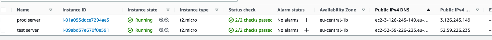

# Web Based ToDo List Application

## To Do List

- [x] 1- User interface for ONLY adding ToDo’s
- [x] 2- Back-end service to store a persistent state of ToDo list
- [x] 3- Writing deployment files of your front-end and back-end
- [x] 4- Automating build, test and deployment of your application via CI/CD pipeline
- [x] 5- Dockerize both your front-end and back-end application to make them ready for deployment.
- [x] 6- Deploy your application to a Kubernetes cluster or Docker Swarm or into a VM using a cloud provider
- [x] 7- Write deployment configurations(i.e. Kubernetes config files, Docker Swarm files etc.) for each project.

## Tech Stack

<ol>
<li>GoLang (backend)
    <ol>
        <li>gin (web framework)</li>
        <li>testify (test framework)</li>
        <li>map for in-memory database</li>
        <li>build tags for go compiler [dev, prod, testenv]</li>
    </ol>
</li>

<li> Vue (frontend) 
    <ol>
        <li>axios (API calls)</li>
        <li>unit tests (vue-test-utils)</li>
        <li>e2e tests (Cypress) `Dockerfile-e2e`</li>
        <li>consumer driven contract test (apiblueprint && dredd) `Dockerfile-contractTests` </li>
    </ol>
</li>

<li>Nginx (Web server)
    <ol>
        <li>`nginx-prod.conf` => Production</li>
        <li>`nginx-test.conf` => Development</li>
    </ol>
</li>


<li>Github Actions (CI)
    <ol>
        <li>`deploy2TestEnv.yml` for test enviroment (Brach: [test]) </li>
        <li>`deploy2ProdEnv.yml` for production enviroment (Branch: [master]) </li>
    </ol>
    **All workflows runs on 'self-hosted' means our AWS machines.** <br/> 
    Test env: **aws-ec2-test** <br/> 
    Prod evv: **aws-ec2**
    (Reason of the choosing Github Actions for CI/CD, my experience)
</li>

<li>Docker && Docker-Compose</li>

<li>2 Free Tier instance on Amazon EC2 (1 Test Env, 1 Production Env)</li>
</ol>

## Directory Structure
```
.
├── Dockerfile // Dockerfile backend
├── config // Config for backend
├── controllers // Backend APIs and their tests
├── docker-compose-prod.yml 
├── docker-compose-test.yml
├── frontend
│   ├── Dockerfile // Dockerfile frontend
│   ├── Dockerfile-contractTests // Dockerfile apiblueprint dredd
│   ├── Dockerfile-e2e // Dockerfile cypress
│   ├── api-description.apib 
│   ├── cypress.json
│   ├── dredd.yml // Dredd settings
│   ├── nginx-prod.conf 
│   ├── nginx-test.conf
│   ├── src
│   ├────── App.vue // App Todo UI
│   ├────── api.js // Axios API Calls
│   └── main.js
│   ├── tests
│   ├────── e2e
│   └────── unit
├── go.mod
├── go.sum
├── main.go

```

## Architecture Decision

0. Two braches test and master (prod) enviroment.

1. I could use `embed` directive in Golang to serve static app files (Vue).
But I wanted to learn nginx+vue+go stack and implement. Because of this I did not use
`embed`.

2. I used two different servers for test and prod in aws cloud provider. 
I wanted to run ui acceptance test and api consumer driven contract test 
in live enviroment in different server. 
(Reason of the choosing AWS, just experience)

3. I created two nginx-{test-prod} file because of the differentation of server name in nginx conf.
With this distinction I could handle cors etc. easily

```
 listen       80;
 server_name  ec2-52-59-226-235.eu-central-1.compute.amazonaws.com;

 location /api/v1 {
   if ($request_method = 'OPTIONS') {
      add_header Access-Control-Allow-Origin '*' always;
      ...
      ....
```

4. I created three dockerfile Dockerfile{,contractTests,e2e} for frontend. Because of this
I can easily builds according to the enviroment.

5. I used **multi-stage build** for my dockerfiles to reduce 
produced image size.

6. I used testenv for backend, and test for frontend as build args. So,
I could easily build docker images for different enviroment just a one Dockerfile.

```
backend:
   build:
     context: "."
     args:
       - ENV=testenv

nginx-frontend:
    build:
      context: ./frontend/
      args:
        - ENV=test
```

Backend Dockerfile, I gave $ENV variable from docker-compose for build 
different enviroments.

```
..
RUN go mod download
COPY . .

RUN CGO_ENABLED=0 go test --tags $ENV ./...
RUN CGO_ENABLED=0 GOOS=linux go build --tags $ENV -o main main.go
..
```

Frontend Dockerfile, I gave $ENV to run related vue build 
and load (nginx-test or nginx-prod) nginx file.
 
```
..
COPY . .
RUN npm run test:unit && npm run build-for-$ENV

FROM nginx:stable-alpine as production-stage
ARG ENV
RUN mkdir /app
COPY --from=build-stage /app/dist /app
COPY --from=build-stage /app/nginx-$ENV.conf /etc/nginx/nginx.conf
..
```

## Pipeline automation




## Servers

[TEST Server](http://ec2-52-59-226-235.eu-central-1.compute.amazonaws.com:8080)

[PROD Server](http://ec2-3-126-245-149.eu-central-1.compute.amazonaws.com:8080)

## Development enviroment

### With standole

For our backend app, you must give "tag" for go compiler. 

`$ go run --tags dev main.go` 

it runs **:3000**

For tests: 

`$ go test --tags dev ./...`

#### APIs
`[POST]` `api/v1/addTodo` 

`$ curl -H "Content-type: application/json" localhost:3000/api/v1/getTodoList`

`[GET]` `api/v1/getTodolist` 

`$ curl -H "Content-type: application/json" -X POST -d '{"task_description":"dummy"}' localhost:3000/api/v1/addTodo`

For the frontend development server you can run 

`$ npm run serve` 

it runs **:8080**

For Unit tests:

`npm run test:unit`

### With Docker compose

`$ docker-compose -f docker-compose-{test,prod}.yml up --build -d`  